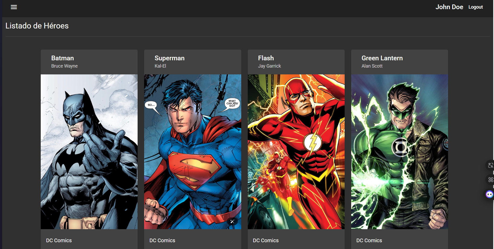
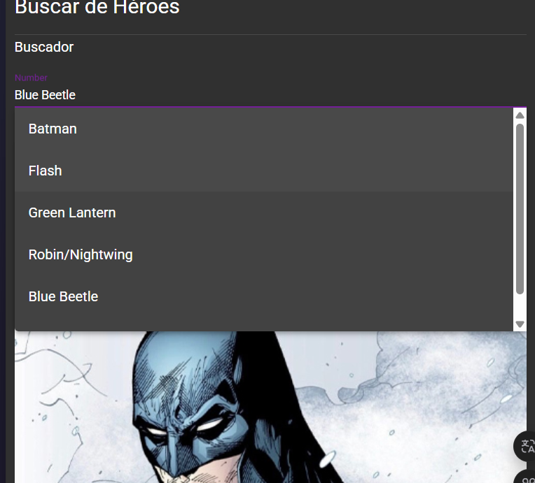

# Heroes App (Angular)

Aplicación Angular para gestión y visualización de héroes (listado, búsqueda, creación/edición y eliminación), con autenticación básica y guardas de ruta. Incluye simulación de backend con **JSON‑Server**.

> Proyecto educativo para practicar **ruteo avanzado**, **módulos perezosos (lazy‑loading)**, **guards (CanLoad/CanActivate)**, **pipes**, **servicios HTTP** y **Angular Material**.

---

## 🧰 Tecnologías

- **Angular**: 11.0.7 (CLI)
- **TypeScript**: 4.0.8
- **RxJS: 6.6.7**
- **Angular Material: 11.2.13**
- **JSON‑Server** (API fake)
- **Node.js** 14.21.3 / **npm** 7+

---

## 📁 Estructura principal

```
src/
├─ app/
│  ├─ auth/           # Módulo de autenticación (login, guard, servicio)
│  ├─ heroes/         # Módulo de héroes (páginas, componentes, pipes, servicios)
│  ├─ shared/         # Componentes compartidos (ErrorPage, etc.)
│  ├─ material/	      # Módulo de carga del contenido de Angular Material
|  └─ app.module.ts
├─ assets/
├─ environments/      # baseUrl para dev/prod
└─ index.html
```

---

## ⚙️ Requisitos previos

1. **Node.js 14.21.3** y **npm 7**
2. **Angular CLI** (global):
   ```bash
   npm install -g @angular/cli
   ```

---

## 🚀 Instalación

```bash
# 1) Clonar el repositorio
git clone https://github.com/Xanaks15/heroesApp.git
cd heroesApp

# 2) Instalar dependencias
npm install
```

---

## 🖥️ Ejecutar la app (frontend)

```bash
# Modo desarrollo
ng serve -o
```

- Por defecto se sirve en `http://localhost:4200/`.
- La app espera un backend en `http://localhost:3000` (ver `environment.ts`).

---

## 🗄️ Simulación de backend con JSON‑Server

### 1) Instalar JSON‑Server (global o dev)

```bash
npm install -g json-server
# o como dependencia de desarrollo
npm install -D json-server
```

### 2) Base de datos fake

Coloca un archivo `db.json` en la raíz del proyecto (o en `mock/db.json`). Ejemplo mínimo compatible:

```json
{
  "usuarios": [
    { "id": "1", "email": "demo@heroes.app", "usuario": "DemoUser" }
  ],
  "heroes": [
    {
      "id": "batman",
      "superhero": "Batman",
      "publisher": "DC Comics",
      "alter_ego": "Bruce Wayne",
      "first_appearance": "Detective Comics #27",
      "characters": "Bruce Wayne"
    }
  ]
}
```

### 3) Levantar el servidor

```bash
# Si db.json está en la raíz
json-server --watch db.json --port 3000

# Si está en mock/db.json
json-server --watch mock/db.json --port 3000
```

- Endpoints de ejemplo:
  - `GET http://localhost:3000/usuarios/1`
  - `GET http://localhost:3000/heroes`
  - `GET http://localhost:3000/heroes?id=batman`

> **Nota**: asegúrate de que `baseUrl` en `src/environments/environment.ts` sea `http://localhost:3000` para desarrollo.

---

## 🔐 Autenticación (mock)

- **Login**: hace `GET /usuarios/1` y guarda el `id` en `localStorage`.
- **Guards**: `AuthGuard` protege rutas del módulo `heroes` con `CanLoad`/`CanActivate` revisando si existe `id` en `localStorage` y validándolo contra el backend fake.

---

## 🧭 Navegación principal

- `/auth/login`
- `/heroes` (layout con `mat-sidenav`)
  - `/heroes/listado`
  - `/heroes/agregar`
  - `/heroes/buscar`

---

## 🧪 Comandos útiles

| Acción                                      | Comando                                        |
| -------------------------------------------- | ---------------------------------------------- |
| Ver el estado actual                         | `git status`                                 |
| Ver historial de commits                     | `git log --oneline --graph --decorate --all` |
| Cambiar a una rama existente                 | `git checkout <rama>`                        |
| Crear y cambiar a una nueva rama             | `git checkout -b <nombre-rama>`              |
| Agregar todos los cambios                    | `git add .`                                  |
| Hacer commit                                 | `git commit -m "mensaje"`                    |
| Subir al remoto                              | `git push origin <rama>`                     |
| Traer cambios del remoto                     | `git pull origin <rama>`                     |
| Revertir todo al commit anterior             | `git reset --hard <hash>`                    |
| Revertir sin borrar cambios locales          | `git reset --soft <hash>`                    |
| Deshacer último commit (sin perder cambios) | `git reset --soft HEAD~1`                    |
| Revertir un commit publicado                 | `git revert <hash>`                          |
| Crear un tag (versión)                      | `git tag -a v1.0 -m "Versión inicial"`      |
| Subir tags al remoto                         | `git push origin --tags`                     |

## 🖼️ Capturas (opcional)

Coloca tus imágenes en `assets/screenshots/` y referencia aquí, por ejemplo:




---

## 🧯 Solución de problemas

- **CORS/puerto**: verifica que JSON‑Server corre en el **3000** y que el `baseUrl` coincide.
- **`Property 'usuario' does not exist on type '{}'`**: asegúrate de tipar el getter de `AuthService` y usa `auth?.usuario` en la plantilla cuando aplique.
- **`Cannot GET /heroes/...`** al refrescar: asegúrate de servir con el dev server de Angular o configurar `fallback` en producción.

---

## 👤 Créditos

- Proyecto basado en prácticas de Angular con ruteo, guards y Angular Material.
- Autor/a: (@xanaks15)
